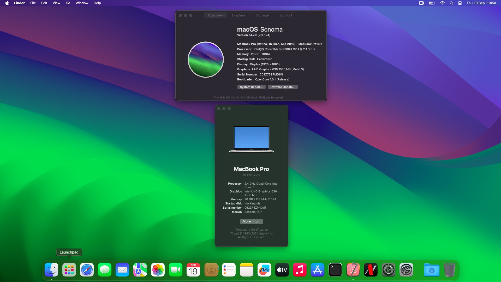

# OpenCore-HP-ZBook15-G6-Sonoma

This repo contains the files and scripts to install macOS Ventura on the Lenovo X270 20K5  
You need to patch your systems own [DSDT](https://dortania.github.io/Getting-Started-With-ACPI/ssdt-methods/ssdt-methods.html).  
SMBIOS : MacBookPro16,1 (MacBook Pro Retina, 16-inch, Mid-2019)  

# Update History
- [x] macOS 12
- [x] macOS 13
- [x] macOS 14
- [x] macOS 14.4
- [x] macOS 14.7 (23H124)
- [ ] macOS 15 (to test)

- [ ] # Laptop's Hardware
- <b>Model</b>: HP ZBook 15 G6 Mobile Workstation
- <b>CPU</b>: Intel(R) Core(TM) i5-9300h CPU @ 2.40GHz
- <b>iGPU</b>: Intel UHD Graphics 630 1536Mo (Metal 3)
- <b>dGPU</b>: NVidia Quadro T1000 4GB (disabled)
- <b>RAM</b>: 20 GB DDR4
- <b>Screen</b>: 15.6" IPS touchscreen 1920 x 1080
- <b>Wi-Fi</b>: WiFi 6 AX200
- <b>Ethernet</b>: Intel l219-LM
- <b>Camera</b>: 720p
- <b>Battery</b>: 90 Wh	4-cell lithium polymer

# What's Working?
- [x] Intel HD 630 Graphics (metal 3)
- [x] CPU Power Management
- [x] Battery
- [x] All USB ports
- [x] Intel Ethernet port
- [x] Internal camera (including Facetime)
- [x] Trackpad (including gestures)
- [x] Shutdown / Reboot / Sleep
- [x] Keyboard (fn keys not working right now)
- [x] Wi-Fi
- [x] Sleep / Wake (lid sleep and lid wake)

# What's not working ⚠️
- [ ] Fn Keys
- [ ] Audio
- [ ] Bluetooth
- [ ] Trackpad a bit weird

# In testing ⚠️
- [ ] Audio Jack
- [ ] HDMI
- [ ] SD Card Reader
- [ ] DRM
- [ ] Apple Service
